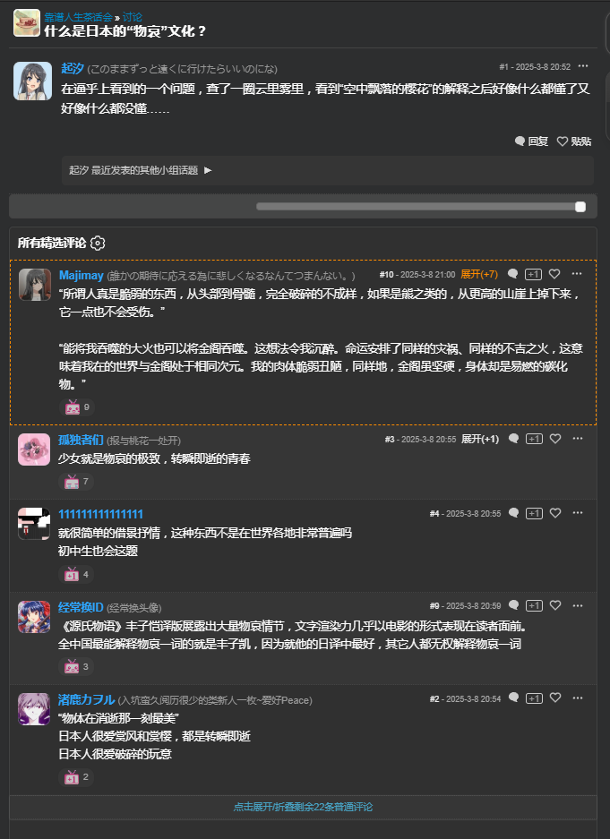
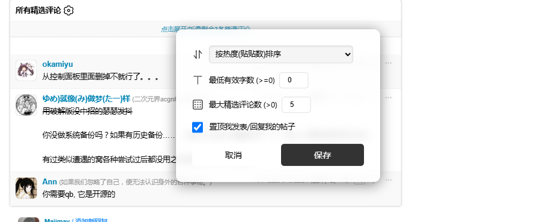

## 特性

- 子评论（楼中楼）自动折叠
- 自定义规则：根据贴贴数/时间正反顺序/评论数排序
- 取消置顶/置顶自己参与的评论
- 显示/隐藏开播前发表的评论
- 设定**最低有效字数**和**精选评论数**来显示不被折叠的评论数
- 支持小组帖子和番剧分集剧情页的评论管理

## 反馈

https://bgm.tv/group/topic/399446

## 预览（0.2.4）

<table>

</table>

## 视频预览

https://www.youtube.com/watch?v=_ImSpa0Ef-8

## 寄语

如果觉得本脚本对你有帮助，给我点个STAR吧！♪(･ω･)ﾉ

bug或者功能提议可以在issues里直接提出！

## 致敬

https://bgm.tv/dev/app/14/gadget/108
